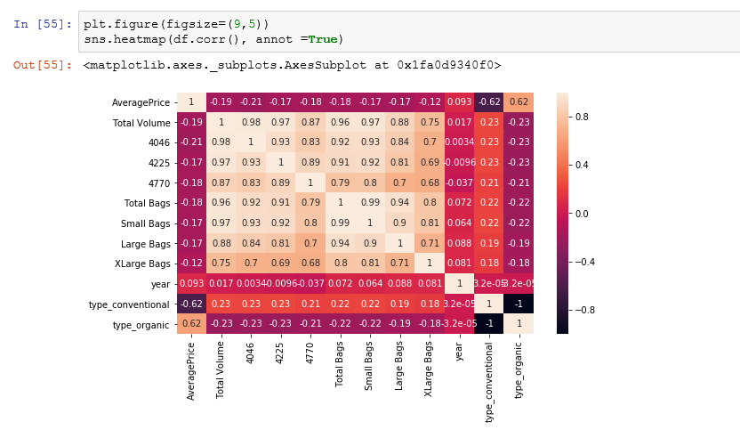
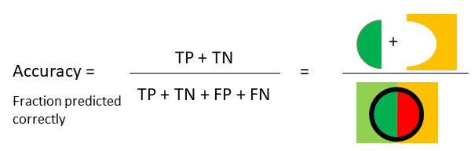

<!DOCTYPE html>
<html>
  <head>
  </head>
  <body>
    <h1>Student Performance Exam Analysis in R</h1>
    
This project involves analyzing student performance data to predict math scores based on reading and writing scores, and finding the best linear regression model for the data.

    <h2>Data Analysis and Visualization</h2>
    
After cleaning and processing the data, various visualizations were created to explore the relationships between the variables:

    
    
A heatmap of the correlation matrix shows that there is a strong positive correlation between math and reading scores, and between math and writing scores.

    
    
A scatterplot of math scores vs. reading scores shows a linear relationship between the two variables, suggesting that a linear regression model may be appropriate for predicting math scores based on reading scores.

    <h2>Linear Regression Model</h2>
    
Multiple linear regression was used to predict math scores based on reading and writing scores. The model was evaluated using cross-validation, and the performance metrics were calculated:

    
    
The best linear regression model had an R-squared value of 0.87, indicating that 87% of the variance in math scores can be explained by reading and writing scores. The model was used to make predictions on new data, and the results were visualized:

    
    
The predictions show a strong linear relationship between math and reading scores, and between math and writing scores.

    <h2>Conclusion</h2>
    
This project demonstrates how to analyze and visualize student performance data, and how to create a linear regression model to predict math scores based on reading and writing scores.

  </body>
</html>
